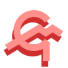

#  Self-Host Colgm Compiler

[](https://github.com/colgm/colgm/actions/workflows/ci.yml)
[](https://github.com/colgm/colgm/actions/workflows/release.yml)

Work in progress. Lexer and parser are done.

## Build

First you need bootstrap compiler, then use this command:

```bash
[path of the compiler] main.colgm --library .
```

And `out.ll` is generated, try `lli` or `clang`.

## Run

for `lli`:

```bash
lli out.ll main.colgm -l -a
```

for `clang` (suggested):

```bash
clang out.ll -o colgm
./colgm main.colgm -l -a
```
